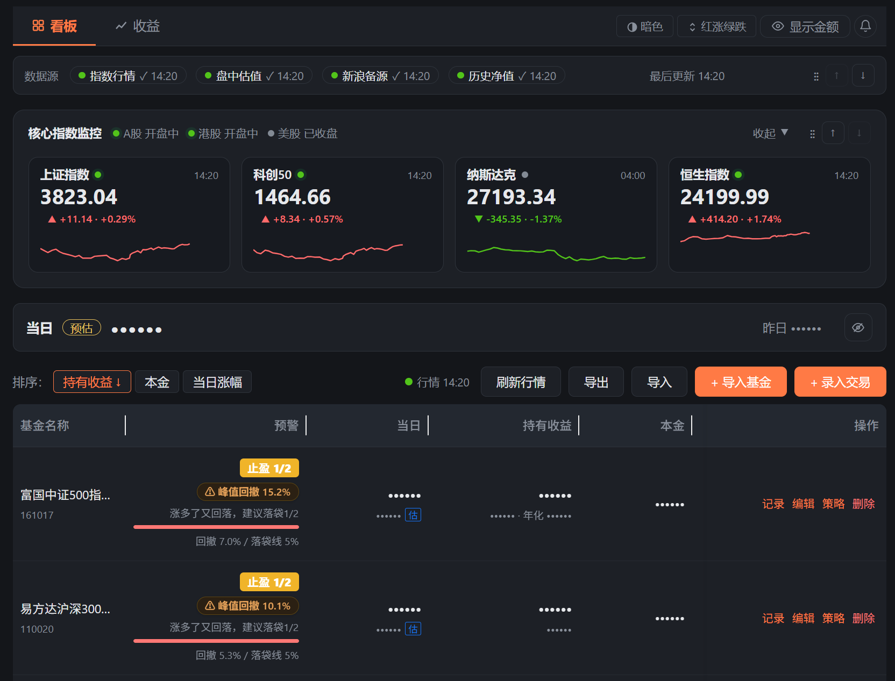
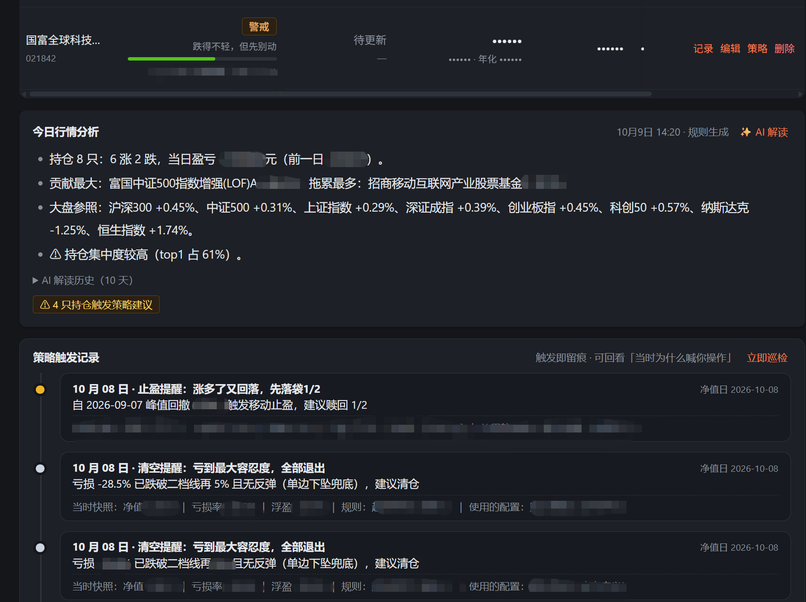
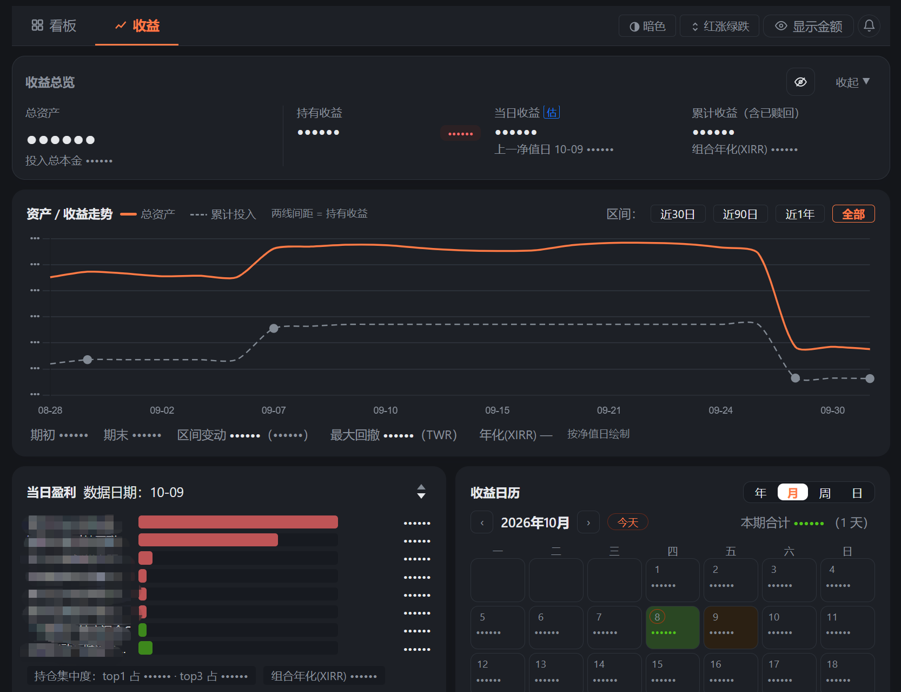

# 理财看板（fundboard）

个人基金理财看板：录入持仓与交易，自动计算投入本金，包括当日行情看板和收益页两部分。

**能做什么**：

- 📊 **本金与持仓台账**：录入交易自动算加权平均成本，看清每只基金的本金、份额、持有收益。
- 📈 **行情与走势**：盘中估值、历史净值走势（含成本对照线）、大盘指数与当天分时。
- 💰 **收益页**：总收益、资产与收益走势、收益日历、持仓构成、收益率对比，当日盈亏还能看归因、集中度和年化收益。
- ⚠️ **策略预警**：持有 / 关注 / 警戒 / 补仓 / 止盈 / 止损 / 清仓七种状态，根据自定义规则帮你监督。
- 🤖 **AI 解读**：基于真实持仓解读收益来源、集中度与风险点（金额不出网）。
- 📸 **截图识别录入**：交易截图直接识别预填，长截图多笔批量导入、自动判重。

**架构特点**：零构建。前端 Vue3 / Chart.js 走 CDN + 原生 ES Modules；服务端 Node 零第三方依赖（静态托管 + 行情代理 + JSON 文件存储）。行情任何失败都自动降级，离线体验完整保留。

## **系统截图**

### 看板






### 收益页




## 使用方法

要求：Node.js ≥ 18（[官网下载](https://nodejs.org/)，或用 `nvm`/`fnm` 等版本管理器安装）。

### 快速开始

**方式一：命令行启动**（Windows 用 cmd 或 PowerShell，macOS / Linux 用终端，命令相同）：

```bash
git clone https://github.com/ly181021/fundboard.git
cd fundboard
npm start
```

**方式二：丢给 AI 帮你跑**

把下面这段话原样发给你的 AI 助手（Claude / ChatGPT / Cursor 等）：

> 帮我在这台电脑上部署 fundboard 项目：克隆 https://github.com/ly181021/fundboard ，确认 Node.js ≥ 18（没有就先装），然后运行 `npm start`，最后告诉我浏览器该打开哪个地址。

`npm start` 无需任何依赖安装（服务端零第三方依赖），启动后访问 http://localhost:8123（仅本机访问，默认端口固定 8123）。

### 换端口

以9000为例：

```
# windows powershell
$env:PORT = "9000" 
npm start

# windows cmd
set "PORT=9000" && npm start

# macOS / Linux
PORT=9000 npm start                      
```

### 手机端局域网访问

`APP_TOKEN` 以  `abc123` 为例（电脑和手机连同一个 Wi-Fi）：

```
# windows powershell
$env:HOST = "0.0.0.0"
$env:APP_TOKEN = "abc123"
npm start

# windows cmd
set "HOST=0.0.0.0" && set "APP_TOKEN=abc123" && npm start

# macOS / Linux
HOST=0.0.0.0 APP_TOKEN=abc123 npm start
```

`APP_TOKEN` **由你自己设定**，启动命令里填什么，其他设备访问时就输入什么。局域网访问不设口令会直接拒绝启动。

1. 启动后看控制台日志，会打印一行局域网访问地址，例如：`局域网访问：http://192.168.1.100:8123（需 X-App-Token）`（数字每台电脑不同，以日志为准）。
2. 手机浏览器打开这个地址，页面会提示输入口令，输入口令 `abc123`（输入一次浏览器会记住）。
3. 之后手机上正常使用所有功能，数据实时存在电脑的 `data/db.json` 里。

其他问题：
1. 日志没打印，可自己查 IP 拼地址：Windows 运行 `ipconfig` 看"IPv4 地址"，macOS 系统设置 → Wi-Fi → 详细信息，地址就是 `http://查到的IP:8123`
2. **已经在跑 `npm start`，想改开局域网**：环境变量在启动时读取，中途改不了，需要重启服务。步骤：
	1. 停掉当前服务：在运行它的窗口按 `Ctrl+C`（或 Windows 下另开 cmd 执行 `taskkill //F //PID <进程号>`，进程号用 `netstat -ano | findstr :8123` 查最后一列）。用 `npm run service:restart` 后台启动的，直接再运行一次它即可。
	2. 用带 `HOST` 和 `APP_TOKEN` 的命令重新启动（写法见上方「手机端局域网访问」代码块，换成你的口令）。
	3. 看日志里的局域网地址，手机访问（同上）。数据不受影响：重启不丢数据，全在 `data/db.json` 里。

### 模型配置（可选）

AI 解读和截图识别依赖模型配置：未配置时仅这两个功能失效，看板其余功能正常可用。

两项功能共用 `ocr.config.json` 的 `baseUrl`、`apiKey`、`model` 三个参数：

1. 复制示例文件 `ocr.config.example.json` 并重命名为 `ocr.config.json`。
2. 填入接口信息，**保存即生效，不用重启**。也可改用环境变量：`OCR_API_BASE` / `OCR_API_KEY` / `OCR_MODEL`。

默认适配阿里云 DashScope 兼容模式（qwen-vl 系列）。只要是 OpenAI 兼容接口，修改这三个参数就能接入。

如需单独设置 AI 解读使用的模型，可以添加可选 `analysis` 配置节点；不配置该节点则复用顶层参数：

```json
{ "baseUrl": "…", "apiKey": "…", "model": "qwen-vl-max", "analysis": { "model": "qwen-plus" } }
```

- **AI 解读**：调用超时默认 60 秒（`ANALYSIS_TIMEOUT_MS` 环境变量可覆盖）。请选"生成快"的模型：网关对过慢的模型约 15 秒就会自行返回 524。**推理模型的思考区**：配置项 `enableThinking`（默认 `false`）控制请求是否携带 `enable_thinking: false`——关闭推理模型的思考区，避免生成预算全烧在思考、正文为空导致超时；写在顶层对两个功能生效，也可只在 `analysis` 段单独指定（未写回落顶层）。非推理模型会忽略该参数，保持默认即可。**若你的网关不认这个参数**、模型仍然秒回 524，多为思考区问题，换非推理模型即可（实测 deepseek-v4.1-flash：开思考 10~15 秒撞窗超时，关后 3 秒内返回；需要恢复思考区时设 `true`）。
- **截图识别**：需要视觉模型（能读图片的模型，如 qwen-vl 系列）。
- 配置文件已 gitignore，key 不入库。
- 模型调用失败时页面会给出可读的中文提示（如"模型不可用，请更换 model"），原始报错记录在服务端日志中，可按提示排查。

## 数据与备份

| 位置               | 内容                           | 说明                         |
| ---------------- | ---------------------------- | -------------------------- |
| `data/db.json`   | 数据库（全部持仓、交易与每日资产快照）  | 原子写，页面改动实时保存，清浏览器数据不影响     |
| `data/backups/`  | 每日自动备份（`db-YYYY-MM-DD.json`） | 保留最近 30 天，`BACKUP_KEEP` 可调 |
| 浏览器 localStorage | 离线镜像 + 行情缓存                  | 服务不可达时自动兜底，恢复后自动重推改动       |

- 数据不进 git（已 gitignore）。跨机器迁移或灾备用**"导出 JSON"按钮**，"导入"可直接恢复历史备份文件。
- 服务端为空而浏览器有旧数据时，页面会出现"一键上传到服务端"迁移提示。
- 双开窗口有乐观锁保护：后保存的一方会收到冲突提示，不会静默覆盖。

## 行情说明

- 主表每只基金的估值与净值：天天基金 / 东方财富公开接口（服务端代理并带缓存，备源蛋卷基金）。
- 核心指数监控：东方财富 push2 接口。
- **盘中估值接口已官方下线**：看板在当日净值发布前显示"—"，净值发布后（约 15:00–24:00）自动出现；工作日该时段每 60 秒轮询，另有手动刷新按钮。
- 任何行情失败 → 状态点变红 + 黄条提示 + 对应列回"待更新"，**录入 / 预警 / 导入导出完全不受影响**。

## 定时快照（自动积累资产曲线）

服务端自带每日快照任务：工作日 15:00–24:00 每 30 分钟检查一次，等全部持仓的当日确认净值发布后自动把「总资产 / 总本金 / 总收益」写入 `db.json` 的 daily 区，**不开页面也能积累资产曲线**；服务启动时会先补漏一轮（重启后自动补上漏掉的日子）。记录日期取净值日期而非"今天"，节假日不会记错日期。

```bash
SNAPSHOT_TASK=off npm start            # 关闭该任务（默认开启）
SNAPSHOT_INTERVAL_MIN=10 npm start     # 调检查间隔（默认 30，下限 5）
```

快照口径与页面完全一致（复用同一套本金计算）；任一基金缺行情或净值日期不一致时本轮跳过、下轮重试，不写误导数据。

## 策略预警

每个交易日自动评估每只持仓，给出七种状态之一（**持有 / 关注 / 警戒 / 补仓 / 止盈 / 止损 / 清仓**），并按既定参数给出补仓建议与止盈止损触发线。点击持仓表的预警徽章可打开详情卡：风险仪表、补仓预演、冷却进度、一键复制交易备忘，QDII 净值滞后也有角标提示。止损执行后进入锁定冷却，不会每个净值日重复提醒；可在详情卡「忽略」本轮提醒。

> 所有预警与分析均为根据个人设定条件计算出的**参考信息**，不构成投资建议或买卖指令（见下方免责声明）。

## 隐私

- **AI 解读「金额不出网」**：点「✨ AI 解读」时发往模型的数据**不含任何绝对金额**，只传比例、占比、只数、策略状态、指数涨跌幅等相对信息，报告里的金额替换为占位符；该脱敏有单测锁死。
- **这些数据会离开本机**：AI 解读与截图识别的请求发往你配置的第三方 OpenAI 兼容网关，内容含基金名称、收益率、持仓占比、策略状态等（不含金额）。
- **打码（👁）只管屏幕**：「隐藏资产数字」只影响页面显示，与出网脱敏是两件独立的事：金额不出网是默认行为，不依赖打码开关。

## ⚠️ 免责声明

- 本工具是一个**记账与信息整理工具**，不构成任何**投资建议或买卖指令**；预警、分析、AI 解读均为基于历史数据的**参考信息**，请自行决策、风险自负。
- 策略预警依据历史净值和既定规则推算，**历史表现不预示未来收益**；回测与推演存在模型简化、数据时滞等固有局限（如 QDII 净值滞后、法定节假日不感知等），不可作为收益承诺。
- 行情数据来自第三方公开接口，可能存在**延迟、错误或中断**，请以基金公司官方披露为准；本工具对数据准确性不作担保。
- AI 生成内容可能存在错误或幻觉，**不应作为决策唯一依据**。
- 数据安全是**你自己的责任**：请自行做好备份（见「数据与备份」），部署到局域网时请务必设置访问口令；数据丢失或因依赖本工具产生的任何直接/间接损失，作者不承担责任。
- 基金投资有风险，入市需谨慎。

## 开发

```bash
npm test    # node:test 单元测试（纯函数层：calculator/store/quotes/analysis/lib）
```

- 零构建、零依赖（前端 CDN 引入，服务端仅用 Node 内置模块），clone 后无需 `npm install` 即可跑。
- 测试用 node:test 原生框架，`npm test` 一条命令跑全部。
- 详细使用说明见项目内用户文档（功能介绍与操作指引，随版本提供）。

## 版本

- **v0.5.0**：首个公开版本。本金与持仓台账、行情与走势、收益页、策略预警（七态 + 详情弹窗）、AI 解读（金额不出网）、截图识别录入。